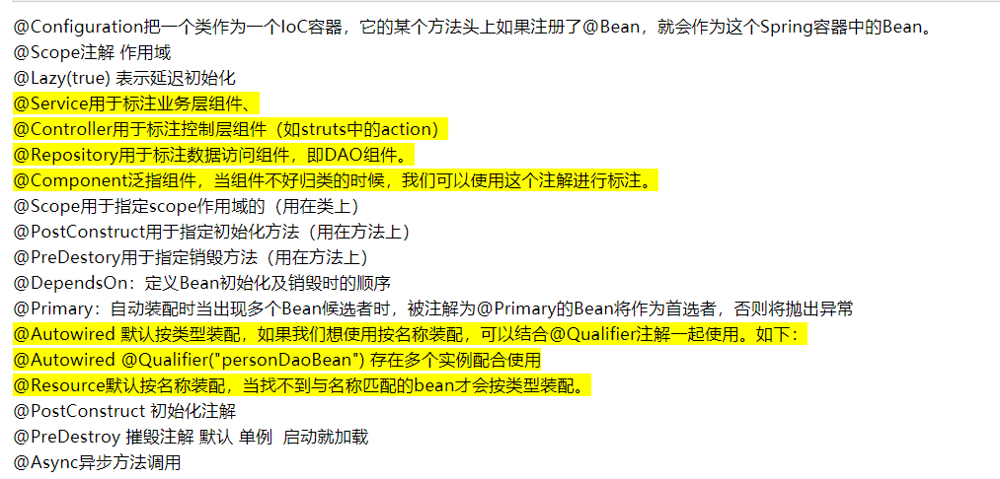

# Spring注解详解

@Autowire：自动装配，是指在Spring容器中按照类型查找
与当前属性相匹配的Bean并把查找到的Bean装配到该属性中。

@qualifier("String")：与@Autowire类似，它是按照名称来查找Spring容器中
与之匹配的Bean

@Resource的装配顺序：
(1)、@Resource后面没有任何内容，默认通过name属性去匹配bean，找不到再按type去匹配
(2)、指定了name或者type则根据指定的类型去匹配bean
(3)、指定了name和type则根据指定的name和type去匹配bean，任何一个不匹配都将报错

区分一下@Autowired和@Resource两个注解的区别：
(1)、@Autowired默认按照byType方式进行bean匹配，@Resource默认按照byName方式进行bean匹配
(2)、@Autowired是Spring的注解，@Resource是J2EE的注解，这个看一下导入注解的时候这两个注解的包名就一清二楚了
Spring属于第三方的，J2EE是Java自己的东西，因此，建议使用@Resource注解，以减少代码和Spring之间的耦合。

