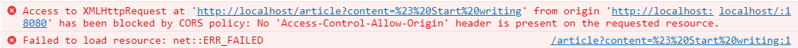

在vue项目中，由于采用了前后端分离
导致产生了跨域请求
在浏览器中出现下列错误


此时 ，我们需要在后端编写跨域请求配置

```java

@Configuration
public class CorsConfig {
    private CorsConfiguration buildConfig() {
        CorsConfiguration corsConfiguration = new CorsConfiguration();
        corsConfiguration.setAllowCredentials(true);  //sessionid 多次访问一致
        // 允许访问的客户端域名
        List<String> allowedOriginPatterns = new ArrayList<>();
        allowedOriginPatterns.add("*");
        corsConfiguration.setAllowedOriginPatterns(allowedOriginPatterns);
//        corsConfiguration.addAllowedOrigin("*"); // 允许任何域名使用
        corsConfiguration.addAllowedHeader("*"); // 允许任何头
        corsConfiguration.addAllowedMethod("*"); // 允许任何方法（post、get等）
        return corsConfiguration;
    }

    @Bean
    public CorsFilter corsFilter() {
        UrlBasedCorsConfigurationSource source = new UrlBasedCorsConfigurationSource();
        source.registerCorsConfiguration("/**", buildConfig()); // 对接口配置跨域设置
        return new CorsFilter(source);
    }
}

```
完成后，重启springboot项目即可。

要注意后端返回的数据与前台，ajax的打他Type是否一致。